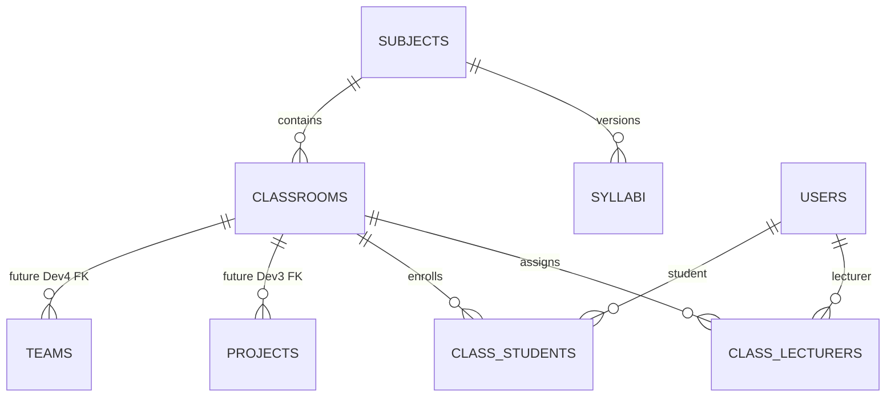

# Dev2 Week 1 - Academic module

## Scope

Week 1 delivers versioned database initialization, subject CRUD, classroom CRUD, and individual lecturer/student assignment. Excel import, full syllabus management, and resource management remain outside this increment.

## Data model



`syllabi`, `projects`, and `teams` are integration boundaries only and are not created by the Week 1 migration. Dev3 and Dev4 should reference `classrooms.id`; project syllabus linkage should reference `subjects.id` or the future `syllabi.id` after its design is finalized.

## Schema lifecycle

- Flyway owns schema creation through `db/migration`.
- Hibernate uses `ddl-auto=validate` and must not mutate shared schemas.
- The dev profile uses H2 in MySQL compatibility mode.
- Empty databases apply V1 (`users`) and V2 (Academic). Existing pre-Flyway MySQL databases are baselined at V1 and then receive V2.

## Subject API

| Method | Endpoint | Roles | Purpose |
|---|---|---|---|
| GET | `/api/v1/subjects?query=` | all authenticated roles | List/search subjects |
| GET | `/api/v1/subjects/{id}` | all authenticated roles | Subject detail |
| POST | `/api/v1/subjects` | ADMIN, STAFF | Create subject |
| PUT | `/api/v1/subjects/{id}` | ADMIN, STAFF | Update subject |
| PUT | `/api/v1/subjects/{id}/status?active=` | ADMIN, STAFF | Activate/deactivate |

Subject code is unique ignoring case at the service boundary and stored uppercase. Credits must be between 1 and 30.

## Classroom API

| Method | Endpoint | Roles | Purpose |
|---|---|---|---|
| GET | `/api/v1/classrooms` | authenticated Academic roles | Staff/Head see all; lecturer/student see assigned classes |
| GET | `/api/v1/classrooms/{id}` | authenticated Academic roles | Detail with access-scope check |
| POST | `/api/v1/classrooms` | ADMIN, STAFF | Create classroom |
| PUT | `/api/v1/classrooms/{id}` | ADMIN, STAFF | Update classroom |
| PUT | `/api/v1/classrooms/{id}/status?active=` | ADMIN, STAFF | Activate/deactivate |
| GET | `/api/v1/classrooms/eligible-members?role=` | ADMIN, STAFF | Active lecturer/student candidates |
| POST/DELETE | `/api/v1/classrooms/{id}/lecturers/{userId}` | ADMIN, STAFF | Assign/remove lecturer |
| POST/DELETE | `/api/v1/classrooms/{id}/students/{userId}` | ADMIN, STAFF | Enroll/remove student |

`role` for eligible members accepts only `LECTURER` or `STUDENT`. Membership endpoints reject users whose account role does not match the collection.

## Frontend routes

- `/staff/subjects`
- `/staff/classrooms`
- `/staff/classrooms/:id`

All three routes require the `STAFF` role. Admin retains API access but does not receive duplicate Academic navigation in this increment.

## Verification

```powershell
cd cosre-backend
mvn.cmd test

cd ..\cosre-frontend
npm.cmd run lint
npm.cmd run build
```
